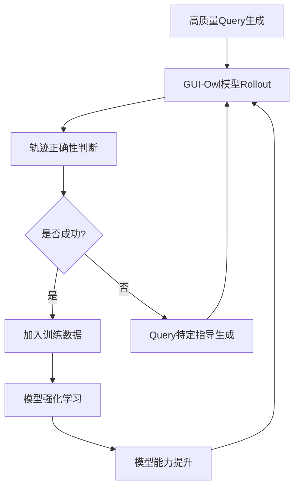

# GUI-Owl 自演化轨迹数据生产工作流分析

## 核心理念
GUI-Owl采用**自演化(Self-Evolving)**的数据生产流程，通过模型自身的能力不断生成新轨迹并评估其正确性，形成数据质量持续改进的闭环，大幅减少人工标注需求。

## 工作流架构

### 1. 环境基础设施 (Large-scale Environment Infrastructure)
- **云端虚拟环境**: 基于阿里云构建，覆盖Mobile、PC、Web三大平台
- **多操作系统支持**: Android、Ubuntu、macOS、Windows
- **动态环境管理**: 实时创建和管理虚拟设备实例，支持大规模并行数据收集

### 2. 核心数据生产流程

#### 2.1 高质量Query生成 (High-Quality Query Generation)

**移动端Query生成策略**:
- **DAG图结构建模**: 人工标注有向无环图G=⟨P,A⟩，P为页面节点，A为页面转换
- **路径采样**: 从DAG中采样现实路径P'={pσ1,...,pσk}
- **元数据提取**: 获取页面描述D'和槽值对K',V'
- **指令合成**: LLM基于元数据生成约束性指令
- **指令精化**: 通过few-shot prompting将导航指令自然化
- **接口验证**: 爬虫实时采集应用界面数据确保准确性

**PC端Query生成策略**:
- **原子操作技能**: 双击、输入、拖拽等基础操作的手工标注
- **软件操作路径**: 
  - 利用a11y树获取可操作元素的位置和功能信息
  - 通过深度搜索链实现树形搜索
  - LLM判断操作路径是否需要预选对象
  - VLM基于截图生成可执行命令

#### 2.2 轨迹生成与收集 (Trajectory Generation)
1. GUI-Owl模型在虚拟环境中逐步预测动作
2. 执行动作并获取环境反馈
3. 收集完整的交互轨迹序列T={(a0,S0),(a1,S1),...,(at,St)}

#### 2.3 轨迹正确性判断 (Trajectory Correctness Judgment)

**双层评估体系**:

**Step-Level Critic (步级评判)**:
- 输入: 前置状态ε、执行动作a、后置状态ε'
- 输出:
  - 分析(Analysis): 动作上下文和后果的详细解释
  - 摘要(Summary): 30词内的关键见解
  - 标注(Annotation): {GOOD, NEUTRAL, HARMFUL}
- 功能: 识别并标记轨迹中的错误步骤

**Trajectory-Level Critic (轨迹级评判)**:
- **双通道评估**:
  - 文本推理通道(πtext): 基于步骤摘要的语义推理
  - 多模态推理通道(πmultimodal): 结合视觉和文本信息
- **共识机制**: 
  ```
  轨迹正确性 = Correct (当且仅当两通道都判定为Correct)
  ```

#### 2.4 Query特定指导生成 (Query-specific Guidance Generation)

对于困难Query的处理:
1. **动作描述生成**: VLM为每个动作生成执行结果描述
2. **质量控制**: 对模型生成的轨迹，VLM验证决策理由与实际效果的一致性
3. **指导合成**: LLM总结关键步骤，生成Query特定的指导

### 3. 下游数据构建管道

基于收集的轨迹，构建多种能力增强数据:

#### 3.1 Grounding数据
- **UI元素定位**: 功能描述、外观布局描述
- **细粒度文本定位**: 单词/字符级别的精确定位
- **数据源**:
  - 开源数据集清洗(UI-Vision, GUI-R1)
  - A11y树合成
  - PC截图密集标注(SAM分割+MLLM)

#### 3.2 任务规划数据
- **历史轨迹蒸馏**: 从成功轨迹中提取任务执行手册
- **大模型知识蒸馏**: Qwen3-235B生成复杂任务规划

#### 3.3 动作语义数据
- **直接预测**: 基于前后截图预测中间动作
- **自然语言描述**: 动作执行及其效果的文本描述

### 4. 推理能力增强

#### 4.1 离线数据合成
- **Hint引导拒绝采样**: 不同风格提示生成多样化推理
- **多智能体框架蒸馏**: Mobile-Agent-v3各角色输出整合
- **通用推理SFT数据**: 保持模型泛化能力

#### 4.2 在线迭代拒绝采样
- **端到端生成**: 直接生成推理和动作
- **Mobile-Agent-v3集成**: 收集角色特定输入输出
- **数据过滤策略**:
  - Critic评分过滤(τc阈值)
  - 思维-动作一致性检查
  - 任务成功率加权
  - 反思器输出平衡

### 5. 强化学习优化

#### 5.1 可扩展RL框架
- **统一任务接口**: 单轮推理和多轮交互的标准化
- **解耦经验生成**: rollout与策略更新分离
- **异步训练**: 支持大规模并行

#### 5.2 轨迹感知相对策略优化(TRPO)
- **轨迹级奖励**: R(τ) = 准确性奖励 + 格式奖励
- **归一化优势估计**: Â_τ = (R(τ)-R̄)/(σR+ε)
- **重放缓冲区**: 存储历史成功轨迹，注入正样本
- **损失函数**:
  ```
  L_TRPO = -1/N ΣΣΣ min[rt(θ)Â_τi, clip(rt(θ),1-ε,1+ε)Â_τi]
  ```

## 数据生产闭环



## 关键创新点

1. **自演化机制**: 模型能力提升→生成更好轨迹→数据质量提升→模型进一步改进
2. **多层次质量控制**: 步级+轨迹级的双层评估确保数据质量
3. **困难样本处理**: Query特定指导机制解决高难度任务
4. **全栈数据构建**: 从基础grounding到复杂推理的完整能力覆盖
5. **在线学习优化**: TRPO算法有效处理长序列稀疏奖励问题

## 实施效果

- **数据规模**: 大规模高质量GUI交互轨迹
- **人工成本**: 显著降低人工标注需求
- **模型性能**: 
  - AndroidWorld: 66.4 → 73.3 (with Mobile-Agent-v3)
  - OSWorld: 29.4 → 37.7 (with Mobile-Agent-v3)
- **持续改进**: 自演化循环实现数据和模型的持续优化